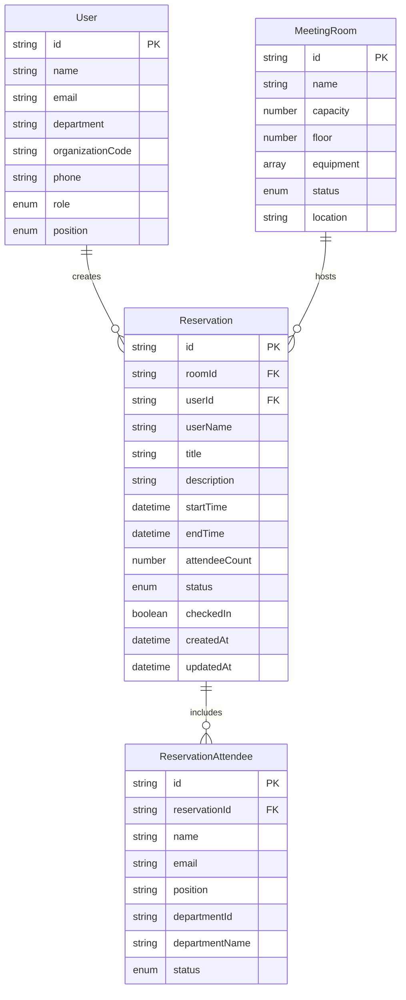

# 📊 데이터 모델링

## 📋 개요

회의실 예약 시스템의 데이터 모델은 **타입 안전성**, **확장성**, **유지보수성**을 핵심 원칙으로 설계되었습니다. TypeScript 기반의 강타입 시스템과 Zod 스키마를 통한 런타임 검증을 통해 데이터 무결성을 보장합니다.

## 🏗️ 모델 아키텍처

### 새로운 모델 구조 (v2.0)
```
src/models/
├── user.model.ts           # 사용자 도메인 모델
├── reservation.model.ts    # 예약 도메인 모델
├── room.model.ts          # 회의실 도메인 모델
├── common.model.ts        # 공통 타입 및 유틸리티
├── schemas.ts             # Zod 런타임 검증 스키마
└── index.ts              # 통합 export
```

### 모델 설계 원칙

#### 1. 도메인 기반 분리 (Domain-Driven Design)
- **도메인별 모델 파일**: 각 비즈니스 도메인을 독립적인 파일로 관리
- **응집도 최대화**: 관련된 타입들을 함께 관리
- **결합도 최소화**: 도메인 간 의존성 최소화

#### 2. DTO 패턴 적용 (Data Transfer Object)
- **API 요청 타입**: `CreateXxxRequest`, `UpdateXxxRequest`
- **API 응답 타입**: `XxxResponse`
- **도메인 모델**: 내부 비즈니스 로직용 타입
- **변환 어댑터**: DTO ↔ 도메인 모델 변환 함수

#### 3. 런타임 검증 (Runtime Validation)
- **Zod 스키마**: 컴파일 타임 + 런타임 타입 안전성
- **자동 검증**: API 요청/응답 자동 검증
- **명확한 에러 메시지**: 개발자 친화적 에러 정보

## 👤 사용자 모델 (User Model)

### 도메인 모델
```typescript
interface User {
  id: string
  name: string
  email: string
  department: string
  organizationCode: string
  phone: string
  role: 'user' | 'admin'
  position: 'CEO' | 'VP' | 'leader' | 'member'
}
```

### DTO 모델
```typescript
// 사용자 생성 요청
interface CreateUserRequest {
  name: string
  email: string
  department: string
  organizationCode: string
  phone: string
  role: 'user' | 'admin'
  position: 'CEO' | 'VP' | 'leader' | 'member'
}

// 사용자 수정 요청 (부분 업데이트)
interface UpdateUserRequest extends Partial<CreateUserRequest> {}

// 사용자 응답 (생성/수정 시간 포함)
interface UserResponse extends User {
  createdAt: string
  updatedAt: string
}
```

### 상수 및 타입
```typescript
export const USER_ROLES = {
  USER: 'user',
  ADMIN: 'admin',
} as const

export const USER_POSITIONS = {
  CEO: 'CEO',
  VP: 'VP', 
  LEADER: 'leader',
  MEMBER: 'member',
} as const

export type UserRole = typeof USER_ROLES[keyof typeof USER_ROLES]
export type UserPosition = typeof USER_POSITIONS[keyof typeof USER_POSITIONS]
```

## 📅 예약 모델 (Reservation Model)

### 도메인 모델
```typescript
interface Reservation {
  id: string
  roomId: string
  userId: string
  userName: string
  title: string
  description?: string
  startTime: string          // ISO 8601 형식
  endTime: string            // ISO 8601 형식
  attendeeCount: number
  attendees?: ReservationAttendee[]
  status: 'confirmed' | 'cancelled' | 'completed'
  qrCode?: string
  checkedIn: boolean
  createdAt: string
  updatedAt: string
}

interface ReservationAttendee {
  id: string
  name: string
  email: string
  position?: string
  departmentId?: string
  departmentName?: string
  status: AttendeeStatus
}

type AttendeeStatus = 'accepted' | 'declined'
```

### DTO 모델
```typescript
// 예약 생성 요청 (클라이언트 → 서버)
interface CreateReservationRequest {
  roomId: string
  title: string
  description?: string
  startTime: string
  endTime: string
  attendees?: Omit<ReservationAttendee, 'id' | 'status'>[]
}

// 예약 수정 요청
interface UpdateReservationRequest extends Partial<CreateReservationRequest> {
  status?: Reservation['status']
  checkedIn?: boolean
}
```

### 변환 어댑터 함수
```typescript
// DTO → 도메인 모델 변환
export const createReservationRequestToReservation = (
  request: CreateReservationRequest,
  userId: string,
  userName: string
): Omit<Reservation, 'id' | 'createdAt' | 'updatedAt'> => {
  const attendees: ReservationAttendee[] = request.attendees?.map((attendee, index) => ({
    ...attendee,
    id: `attendee-${Date.now()}-${index}`,
    status: 'accepted' as AttendeeStatus
  })) || []

  return {
    roomId: request.roomId,
    userId,
    userName,
    title: request.title,
    description: request.description,
    startTime: request.startTime,
    endTime: request.endTime,
    attendeeCount: attendees.length + 1, // 주최자 포함
    attendees,
    status: 'confirmed',
    checkedIn: false
  }
}
```

## 🏢 회의실 모델 (Room Model)

### 도메인 모델
```typescript
interface MeetingRoom {
  id: string
  name: string
  capacity: number
  floor: number
  equipment: string[]
  status: 'available' | 'occupied' | 'disabled'
  location: string
}
```

### 🕒 회의실 가용성 모델 (MeetingRoomAvailability)

이 모델은 특정 날짜에 대한 회의실의 예약 현황(예약 목록)을 표현합니다. UI에서 시간대별 가용 여부를 계산하는데 사용됩니다.

```typescript
interface MeetingRoomAvailability {
  roomId: string
  date: string          // YYYY-MM-DD 형식
  reservations: Reservation[]
}
```

> 📌 **Note**: `reservations`는 동일 날짜의 `Reservation` 도메인 모델 배열입니다. 클라이언트는 이 목록을 기반으로 가용 시간대를 계산하거나 예약을 표시합니다.

### 🔔 알림 모델 (Notification)

```typescript
interface Notification {
  type: 'reservation_created' | 'reservation_updated' | 'reservation_cancelled' | 'meeting_reminder' | 'check_in_required' | 'new_notice' | 'system_update' | 'bulk_update' | 'meeting_invitation'
  data: {
    id: string
    title: string
    message: string
    timestamp: string      // ISO 8601
    userId?: string
    reservationId?: string
    noticeId?: string
    attendeeId?: string
    canRespond?: boolean
  }
}
```

### 📢 공지 모델 (Notice)

```typescript
interface Notice {
  id: string
  title: string
  content: string          // Markdown or HTML
  author: string
  createdAt: string        // ISO 8601
  updatedAt: string        // ISO 8601
  priority: 'urgent' | 'normal' | 'info'
  attachments?: string[]   // file URLs
  views: number
}
```

> 🔎 ERD에도 Notification ↔ User(1:N), Notice(entity only) 관계를 추가해야 합니다.

### DTO 모델
```typescript
// 회의실 생성 요청
interface CreateRoomRequest {
  name: string
  capacity: number
  floor: number
  equipment: string[]
  location: string
}

// 회의실 수정 요청
interface UpdateRoomRequest extends Partial<CreateRoomRequest> {
  status?: MeetingRoom['status']
}

// 회의실 검색 파라미터
interface RoomSearchParams {
  capacity?: number
  floor?: number
  equipment?: string[]
  status?: RoomStatus
  available?: boolean
  startTime?: string
  endTime?: string
}
```

### 상수 정의
```typescript
export const ROOM_STATUS = {
  AVAILABLE: 'available',
  OCCUPIED: 'occupied',
  DISABLED: 'disabled',
} as const

export const COMMON_EQUIPMENT = {
  PROJECTOR: '프로젝터',
  WHITEBOARD: '화이트보드',
  TV: 'TV',
  VIDEO_CONFERENCE: '화상회의',
  AUDIO_SYSTEM: '음향시설',
  COMPUTER: '컴퓨터',
  MICROPHONE: '마이크',
} as const
```

## 🔄 공통 모델 (Common Model)

### API 응답 타입
```typescript
// 표준 API 응답 구조
interface ApiResponse<T> {
  success: boolean
  data: T
  message?: string
  error?: string
}

// 페이징 응답
interface PaginatedResponse<T> {
  data: T[]
  pagination: {
    page: number
    limit: number
    total: number
    totalPages: number
    hasNext: boolean
    hasPrev: boolean
  }
}
```

### 공통 유틸리티 타입
```typescript
// 뷰 모드
export type ViewMode = 'day' | 'week' | 'month'

// 시간 슬롯
export type TimeSlotValue = '08:00' | '08:30' | '09:00' | '09:30' | 
  '10:00' | '10:30' | '11:00' | '11:30' | '12:00' | '12:30' | 
  '13:00' | '13:30' | '14:00' | '14:30' | '15:00' | '15:30' | 
  '16:00' | '16:30' | '17:00' | '17:30' | '18:00' | '18:30' | 
  '19:00'

// 에러 타입
interface ApiError {
  code: string
  message: string
  details?: Record<string, any>
}
```

## 🔍 런타임 검증 스키마 (Zod Schemas)

### 스키마 정의 예시
```typescript
import { z } from 'zod'

// 예약 스키마
export const ReservationSchema = z.object({
  id: z.string().min(1),
  roomId: z.string().min(1),
  userId: z.string().min(1),
  userName: z.string().min(1),
  title: z.string().min(1),
  description: z.string().optional(),
  startTime: z.string().datetime(),
  endTime: z.string().datetime(),
  attendeeCount: z.number().min(1),
  attendees: z.array(ReservationAttendeeSchema).optional(),
  status: z.enum(['confirmed', 'pending', 'cancelled', 'completed']),
  qrCode: z.string().optional(),
  checkedIn: z.boolean(),
  createdAt: z.string().datetime(),
  updatedAt: z.string().datetime(),
}).refine(
  (data) => new Date(data.endTime) > new Date(data.startTime),
  {
    message: "종료 시간은 시작 시간보다 늦어야 합니다",
    path: ["endTime"],
  }
)

// 예약 생성 요청 스키마
export const CreateReservationRequestSchema = z.object({
  roomId: z.string().min(1),
  title: z.string().min(1),
  description: z.string().optional(),
  startTime: z.string().datetime(),
  endTime: z.string().datetime(),
  attendees: z.array(CreateAttendeeSchema).optional(),
}).refine(
  (data) => new Date(data.endTime) > new Date(data.startTime),
  {
    message: "종료 시간은 시작 시간보다 늦어야 합니다",
    path: ["endTime"],
  }
)
```

### 검증 헬퍼 함수
```typescript
// 검증 함수들
export const validateReservation = (data: unknown) => ReservationSchema.parse(data)
export const validateCreateReservationRequest = (data: unknown) => 
  CreateReservationRequestSchema.parse(data)

// API 응답 검증
export const validateApiResponse = <T>(data: unknown, dataSchema: z.ZodSchema<T>) => 
  ApiResponseSchema(dataSchema).parse(data)
```

## 🔄 마이그레이션 가이드

### 기존 타입에서 새 모델로 마이그레이션

#### Before (기존)
```typescript
import { Reservation, MeetingRoom, User } from '../types'
```

#### After (새 구조)
```typescript
import { Reservation, MeetingRoom, User } from '../models'
```

### API 서비스에서 DTO 사용

#### Before
```typescript
async createReservation(reservation: Omit<Reservation, 'id' | 'createdAt' | 'updatedAt'>) {
  // ...
}
```

#### After
```typescript
async createReservation(reservation: CreateReservationRequest) {
  // 입력 검증
  const validatedRequest = validateCreateReservationRequest(reservation)
  
  // DTO → 도메인 모델 변환
  const reservationData = createReservationRequestToReservation(
    validatedRequest, 
    currentUserId, 
    currentUserName
  )
  
  // API 호출
  const result = await api.post('/reservations', reservationData)
  
  // 응답 검증
  return validateReservation(result.data)
}
```

## 📈 데이터 관계도



## 🎯 베스트 프랙티스

### 1. 타입 정의
- **명확한 네이밍**: 의도가 명확히 드러나는 인터페이스명 사용
- **선택적 속성**: `?`를 사용하여 선택적 필드 명시
- **유니온 타입**: 가능한 값들을 명확히 제한

### 2. DTO 설계
- **단일 목적**: 각 DTO는 하나의 명확한 목적을 가짐
- **검증 가능**: Zod 스키마로 검증 가능한 구조
- **변환 가능**: 도메인 모델과 쉽게 변환 가능

### 3. 런타임 검증
- **입력 검증**: 모든 외부 입력에 대한 검증
- **응답 검증**: API 응답 데이터 검증
- **명확한 에러**: 개발자가 이해하기 쉬운 에러 메시지

### 4. 마이그레이션 전략
- **점진적 마이그레이션**: 한 번에 모든 파일을 변경하지 않음
- **하위 호환성**: 기존 코드와의 호환성 유지
- **테스트 우선**: 변경 전 충분한 테스트 작성
