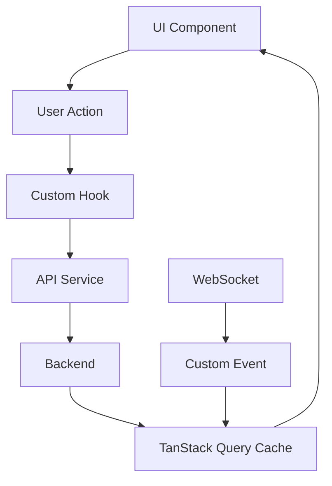
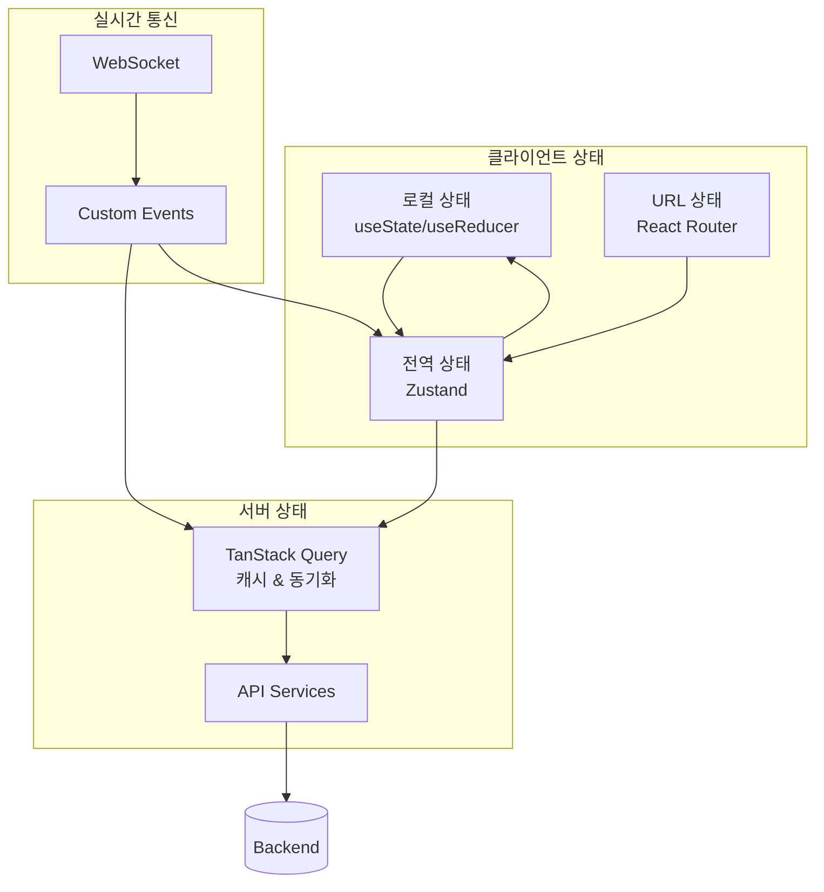

# 🧠 상태 관리

## 📋 개요

회의실 예약 시스템의 상태 관리는 **다층 아키텍처**를 통해 각 상태 유형에 최적화된 도구와 패턴을 사용합니다. 서버 상태, 전역 클라이언트 상태, 로컬 상태, URL 상태를 명확히 분리하여 관리하며, 실시간 동기화를 통해 일관된 사용자 경험을 제공합니다.

## 🎯 상태 관리 원칙

### 1. 상태 분리 원칙 (State Separation)
- **서버 상태**: API에서 가져오는 데이터 (TanStack Query)
- **전역 클라이언트 상태**: 앱 전체에서 공유되는 상태 (Zustand)
- **로컬 상태**: 컴포넌트 내부 상태 (useState/useReducer)
- **URL 상태**: 브라우저 URL과 연동된 상태 (React Router)

### 2. 단방향 데이터 흐름 (Unidirectional Data Flow)


### 3. 실시간 동기화 (Real-time Synchronization)
- **WebSocket → Custom Event → TanStack Query Cache** 파이프라인
- **낙관적 업데이트**: 즉시 UI 반영 후 서버 동기화
- **자동 롤백**: 서버 에러 시 이전 상태로 복원

## 🏗️ 상태 아키텍처

### 상태 분류 및 도구 선택

| 상태 유형 | 관리 도구 | 사용 사례 | 생명주기 |
|-----------|-----------|-----------|----------|
| **서버 상태** | TanStack Query | 예약 목록, 회의실 정보, 사용자 데이터 | API 호출 기반 |
| **전역 클라이언트 상태** | Zustand | 인증 상태, 테마, 알림 설정 | 앱 전체 |
| **로컬 상태** | useState/useReducer | 모달 상태, 폼 입력, 로딩 상태 | 컴포넌트 |
| **URL 상태** | React Router | 현재 페이지, 필터, 검색어 | 브라우저 세션 |

### 상태 흐름도



## 🔄 서버 상태 관리 (TanStack Query)

### 기본 설정
```typescript
// src/lib/queryClient.ts
import { QueryClient } from '@tanstack/react-query'

export const queryClient = new QueryClient({
  defaultOptions: {
    queries: {
      staleTime: 5 * 60 * 1000,        // 5분
      cacheTime: 10 * 60 * 1000,       // 10분
      refetchOnWindowFocus: false,
      retry: 3,
      retryDelay: (attemptIndex) => Math.min(1000 * 2 ** attemptIndex, 30000),
    },
    mutations: {
      retry: 1,
    },
  },
})
```

### 쿼리 키 관리
```typescript
// src/lib/queryKeys.ts
export const queryKeys = {
  // 예약 관련
  reservations: {
    all: ['reservations'] as const,
    lists: () => [...queryKeys.reservations.all, 'list'] as const,
    list: (filters: ReservationFilters) => 
      [...queryKeys.reservations.lists(), filters] as const,
    details: () => [...queryKeys.reservations.all, 'detail'] as const,
    detail: (id: string) => [...queryKeys.reservations.details(), id] as const,
  },
  
  // 회의실 관련
  rooms: {
    all: ['rooms'] as const,
    lists: () => [...queryKeys.rooms.all, 'list'] as const,
    list: (filters: RoomFilters) => [...queryKeys.rooms.lists(), filters] as const,
    details: () => [...queryKeys.rooms.all, 'detail'] as const,
    detail: (id: string) => [...queryKeys.rooms.details(), id] as const,
  },
  
  // 사용자 관련
  users: {
    all: ['users'] as const,
    me: () => [...queryKeys.users.all, 'me'] as const,
    search: (query: string) => [...queryKeys.users.all, 'search', query] as const,
  },
} as const
```

### 데이터 페칭 훅
```typescript
// src/hooks/useReservations.ts
export function useReservations(filters: ReservationFilters) {
  return useQuery({
    queryKey: queryKeys.reservations.list(filters),
    queryFn: () => reservationApiService.getReservations(filters),
    enabled: !!filters.start && !!filters.end,
    select: (data) => data.data, // API 응답에서 data 필드만 추출
  })
}

export function useReservation(id: string) {
  return useQuery({
    queryKey: queryKeys.reservations.detail(id),
    queryFn: () => reservationApiService.getReservation(id),
    enabled: !!id,
    select: (data) => data.data,
  })
}
```

### 뮤테이션 훅
```typescript
// src/hooks/useReservationMutations.ts
export function useCreateReservation() {
  const queryClient = useQueryClient()
  
  return useMutation({
    mutationFn: (data: CreateReservationRequest) => 
      reservationApiService.createReservation(data),
    
    // 낙관적 업데이트
    onMutate: async (newReservation) => {
      // 진행 중인 쿼리 취소
      await queryClient.cancelQueries({ queryKey: queryKeys.reservations.all })
      
      // 이전 데이터 백업
      const previousReservations = queryClient.getQueryData(
        queryKeys.reservations.list(currentFilters)
      )
      
      // 낙관적 업데이트
      queryClient.setQueryData(
        queryKeys.reservations.list(currentFilters),
        (old: Reservation[]) => [
          ...old,
          {
            ...newReservation,
            id: `temp-${Date.now()}`,
            status: 'pending',
            createdAt: new Date().toISOString(),
            updatedAt: new Date().toISOString(),
          },
        ]
      )
      
      return { previousReservations }
    },
    
    // 성공 시
    onSuccess: (data) => {
      // 관련 쿼리 무효화
      queryClient.invalidateQueries({ queryKey: queryKeys.reservations.all })
      queryClient.invalidateQueries({ queryKey: queryKeys.rooms.all })
      
      toast.success('예약이 생성되었습니다')
    },
    
    // 에러 시 롤백
    onError: (error, newReservation, context) => {
      if (context?.previousReservations) {
        queryClient.setQueryData(
          queryKeys.reservations.list(currentFilters),
          context.previousReservations
        )
      }
      
      toast.error('예약 생성에 실패했습니다')
    },
    
    // 완료 후 (성공/실패 무관)
    onSettled: () => {
      queryClient.invalidateQueries({ queryKey: queryKeys.reservations.all })
    },
  })
}
```

## 🌐 전역 클라이언트 상태 (Zustand)

### 인증 스토어
```typescript
// src/stores/authStore.ts
interface AuthState {
  // 상태
  currentUser: User | null
  isAuthenticated: boolean
  isLoading: boolean
  
  // 액션
  login: (credentials: LoginCredentials) => Promise<void>
  logout: () => void
  refreshToken: () => Promise<void>
  updateUser: (user: Partial<User>) => void
}

export const useAuthStore = create<AuthState>((set, get) => ({
  // 초기 상태
  currentUser: null,
  isAuthenticated: false,
  isLoading: true,
  
  // 로그인
  login: async (credentials) => {
    try {
      set({ isLoading: true })
      
      const response = await authService.login(credentials)
      const { user, accessToken, refreshToken } = response.data
      
      // 토큰 저장
      localStorage.setItem('accessToken', accessToken)
      localStorage.setItem('refreshToken', refreshToken)
      
      set({
        currentUser: user,
        isAuthenticated: true,
        isLoading: false,
      })
    } catch (error) {
      set({ isLoading: false })
      throw error
    }
  },
  
  // 로그아웃
  logout: () => {
    localStorage.removeItem('accessToken')
    localStorage.removeItem('refreshToken')
    
    set({
      currentUser: null,
      isAuthenticated: false,
      isLoading: false,
    })
    
    // 쿼리 캐시 초기화
    queryClient.clear()
  },
  
  // 토큰 갱신
  refreshToken: async () => {
    try {
      const refreshToken = localStorage.getItem('refreshToken')
      if (!refreshToken) throw new Error('No refresh token')
      
      const response = await authService.refreshToken(refreshToken)
      localStorage.setItem('accessToken', response.data.accessToken)
    } catch (error) {
      get().logout()
      throw error
    }
  },
  
  // 사용자 정보 업데이트
  updateUser: (userData) => {
    set(state => ({
      currentUser: state.currentUser ? { ...state.currentUser, ...userData } : null
    }))
  },
}))
```

### 알림 스토어
```typescript
// src/stores/notificationStore.ts
interface NotificationState {
  // 상태
  notifications: Notification[]
  unreadCount: number
  settings: NotificationSettings
  
  // 액션
  addNotification: (notification: Notification) => void
  markAsRead: (id: string) => void
  markAllAsRead: () => void
  removeNotification: (id: string) => void
  updateSettings: (settings: Partial<NotificationSettings>) => void
}

export const useNotificationStore = create<NotificationState>((set, get) => ({
  notifications: [],
  unreadCount: 0,
  settings: {
    emailNotifications: true,
    pushNotifications: true,
    reminderTiming: [5, 15],
    notificationTypes: ['reservation_reminder', 'reservation_conflict'],
  },
  
  addNotification: (notification) => {
    set(state => ({
      notifications: [notification, ...state.notifications],
      unreadCount: state.unreadCount + 1,
    }))
  },
  
  markAsRead: (id) => {
    set(state => ({
      notifications: state.notifications.map(n => 
        n.id === id ? { ...n, read: true } : n
      ),
      unreadCount: Math.max(0, state.unreadCount - 1),
    }))
  },
  
  markAllAsRead: () => {
    set(state => ({
      notifications: state.notifications.map(n => ({ ...n, read: true })),
      unreadCount: 0,
    }))
  },
  
  removeNotification: (id) => {
    set(state => {
      const notification = state.notifications.find(n => n.id === id)
      const wasUnread = notification && !notification.read
      
      return {
        notifications: state.notifications.filter(n => n.id !== id),
        unreadCount: wasUnread ? state.unreadCount - 1 : state.unreadCount,
      }
    })
  },
  
  updateSettings: (newSettings) => {
    set(state => ({
      settings: { ...state.settings, ...newSettings }
    }))
  },
}))
```

## 🔌 실시간 동기화

### WebSocket 연결 관리
```typescript
// src/hooks/useWebSocket.ts
export function useWebSocket() {
  const { currentUser } = useAuthStore()
  const queryClient = useQueryClient()
  const { addNotification } = useNotificationStore()
  
  useEffect(() => {
    if (!currentUser) return
    
    const token = localStorage.getItem('accessToken')
    const ws = new WebSocket(`${WS_URL}?token=${token}`)
    
    ws.onopen = () => {
      console.log('WebSocket 연결 성공')
    }
    
    ws.onmessage = (event) => {
      const message: WebSocketMessage = JSON.parse(event.data)
      handleWebSocketMessage(message, queryClient, addNotification)
    }
    
    ws.onclose = () => {
      console.log('WebSocket 연결 종료')
      // 재연결 로직
      setTimeout(() => {
        if (currentUser) {
          // 재연결 시도
        }
      }, 5000)
    }
    
    ws.onerror = (error) => {
      console.error('WebSocket 에러:', error)
    }
    
    return () => {
      ws.close()
    }
  }, [currentUser, queryClient, addNotification])
}
```

### WebSocket 메시지 처리
```typescript
// src/lib/websocketHandler.ts
export function handleWebSocketMessage(
  message: WebSocketMessage,
  queryClient: QueryClient,
  addNotification: (notification: Notification) => void
) {
  switch (message.type) {
    case 'reservation_created':
      handleReservationCreated(message.data, queryClient)
      break
      
    case 'reservation_updated':
      handleReservationUpdated(message.data, queryClient)
      break
      
    case 'reservation_deleted':
      handleReservationDeleted(message.data, queryClient)
      break
      
    case 'notification_received':
      addNotification(message.data.notification)
      break
      
    case 'room_status_changed':
      handleRoomStatusChanged(message.data, queryClient)
      break
      
    default:
      console.warn('알 수 없는 WebSocket 메시지:', message)
  }
}

function handleReservationCreated(
  data: { reservation: Reservation },
  queryClient: QueryClient
) {
  // 예약 목록 캐시 업데이트
  queryClient.setQueryData(
    queryKeys.reservations.lists(),
    (oldData: Reservation[] | undefined) => {
      if (!oldData) return [data.reservation]
      return [data.reservation, ...oldData]
    }
  )
  
  // 관련 쿼리 무효화
  queryClient.invalidateQueries({ queryKey: queryKeys.rooms.all })
  
  // Custom Event 발생 (다른 컴포넌트에서 리스닝 가능)
  window.dispatchEvent(new CustomEvent('reservationCreated', {
    detail: data.reservation
  }))
}
```

### Custom Event 시스템
```typescript
// src/hooks/useCustomEvents.ts
export function useReservationEvents() {
  const [lastCreated, setLastCreated] = useState<Reservation | null>(null)
  const [lastUpdated, setLastUpdated] = useState<Reservation | null>(null)
  const [lastDeleted, setLastDeleted] = useState<string | null>(null)
  
  useEffect(() => {
    const handleCreated = (event: CustomEvent<Reservation>) => {
      setLastCreated(event.detail)
    }
    
    const handleUpdated = (event: CustomEvent<Reservation>) => {
      setLastUpdated(event.detail)
    }
    
    const handleDeleted = (event: CustomEvent<string>) => {
      setLastDeleted(event.detail)
    }
    
    window.addEventListener('reservationCreated', handleCreated)
    window.addEventListener('reservationUpdated', handleUpdated)
    window.addEventListener('reservationDeleted', handleDeleted)
    
    return () => {
      window.removeEventListener('reservationCreated', handleCreated)
      window.removeEventListener('reservationUpdated', handleUpdated)
      window.removeEventListener('reservationDeleted', handleDeleted)
    }
  }, [])
  
  return { lastCreated, lastUpdated, lastDeleted }
}
```

## 🏠 로컬 상태 관리

### 폼 상태 관리
```typescript
// src/hooks/useReservationForm.ts
interface ReservationFormState {
  title: string
  description: string
  roomId: string
  startTime: string
  endTime: string
  attendees: CreateAttendeeRequest[]
}

export function useReservationForm(initialData?: Partial<ReservationFormState>) {
  const [formData, setFormData] = useState<ReservationFormState>({
    title: '',
    description: '',
    roomId: '',
    startTime: '',
    endTime: '',
    attendees: [],
    ...initialData,
  })
  
  const [errors, setErrors] = useState<Record<string, string>>({})
  const [isSubmitting, setIsSubmitting] = useState(false)
  
  const updateField = useCallback((field: keyof ReservationFormState, value: any) => {
    setFormData(prev => ({ ...prev, [field]: value }))
    
    // 에러 클리어
    if (errors[field]) {
      setErrors(prev => ({ ...prev, [field]: '' }))
    }
  }, [errors])
  
  const validate = useCallback(() => {
    const newErrors: Record<string, string> = {}
    
    if (!formData.title.trim()) {
      newErrors.title = '제목을 입력해주세요'
    }
    
    if (!formData.roomId) {
      newErrors.roomId = '회의실을 선택해주세요'
    }
    
    if (!formData.startTime) {
      newErrors.startTime = '시작 시간을 선택해주세요'
    }
    
    if (!formData.endTime) {
      newErrors.endTime = '종료 시간을 선택해주세요'
    }
    
    if (formData.startTime && formData.endTime) {
      if (new Date(formData.endTime) <= new Date(formData.startTime)) {
        newErrors.endTime = '종료 시간은 시작 시간보다 늦어야 합니다'
      }
    }
    
    setErrors(newErrors)
    return Object.keys(newErrors).length === 0
  }, [formData])
  
  const reset = useCallback(() => {
    setFormData({
      title: '',
      description: '',
      roomId: '',
      startTime: '',
      endTime: '',
      attendees: [],
    })
    setErrors({})
    setIsSubmitting(false)
  }, [])
  
  return {
    formData,
    errors,
    isSubmitting,
    updateField,
    validate,
    reset,
    setIsSubmitting,
  }
}
```

### 모달 상태 관리
```typescript
// src/hooks/useModal.ts
export function useModal(initialOpen = false) {
  const [isOpen, setIsOpen] = useState(initialOpen)
  const [data, setData] = useState<any>(null)
  
  const openModal = useCallback((modalData?: any) => {
    setData(modalData)
    setIsOpen(true)
  }, [])
  
  const closeModal = useCallback(() => {
    setIsOpen(false)
    setData(null)
  }, [])
  
  const toggleModal = useCallback(() => {
    setIsOpen(prev => !prev)
  }, [])
  
  return {
    isOpen,
    data,
    openModal,
    closeModal,
    toggleModal,
  }
}
```

## 🔗 URL 상태 연동

### URL 기반 필터 관리
```typescript
// src/hooks/useUrlFilters.ts
export function useUrlFilters() {
  const [searchParams, setSearchParams] = useSearchParams()
  
  const filters = useMemo(() => ({
    start: searchParams.get('start') || format(new Date(), 'yyyy-MM-dd'),
    end: searchParams.get('end') || format(addDays(new Date(), 7), 'yyyy-MM-dd'),
    roomId: searchParams.get('roomId') || '',
    viewMode: (searchParams.get('view') as ViewMode) || 'day',
  }), [searchParams])
  
  const updateFilters = useCallback((newFilters: Partial<typeof filters>) => {
    const updatedParams = new URLSearchParams(searchParams)
    
    Object.entries(newFilters).forEach(([key, value]) => {
      if (value) {
        updatedParams.set(key, value)
      } else {
        updatedParams.delete(key)
      }
    })
    
    setSearchParams(updatedParams)
  }, [searchParams, setSearchParams])
  
  return { filters, updateFilters }
}
```

## 🎯 상태 관리 베스트 프랙티스

### 1. 상태 정규화
```typescript
// ❌ 중첩된 객체 구조
interface BadState {
  reservations: {
    [roomId: string]: {
      [date: string]: Reservation[]
    }
  }
}

// ✅ 정규화된 구조
interface GoodState {
  reservations: Record<string, Reservation>
  reservationsByRoom: Record<string, string[]>
  reservationsByDate: Record<string, string[]>
}
```

### 2. 선택적 구독
```typescript
// ✅ 필요한 상태만 구독
const userName = useAuthStore(state => state.currentUser?.name)
const isAuthenticated = useAuthStore(state => state.isAuthenticated)

// ❌ 전체 상태 구독 (불필요한 리렌더링)
const authState = useAuthStore()
```

### 3. 메모이제이션 활용
```typescript
// 복잡한 계산 결과 메모이제이션
const processedReservations = useMemo(() => {
  return reservations
    .filter(r => r.status === 'confirmed')
    .sort((a, b) => new Date(a.startTime).getTime() - new Date(b.startTime).getTime())
    .map(r => ({
      ...r,
      displayTime: formatTimeRange(r.startTime, r.endTime)
    }))
}, [reservations])
```

### 4. 에러 바운더리와 상태
```typescript
// 에러 상태 관리
export function useErrorHandler() {
  const [error, setError] = useState<Error | null>(null)
  
  const handleError = useCallback((error: Error) => {
    setError(error)
    console.error('상태 관리 에러:', error)
  }, [])
  
  const clearError = useCallback(() => {
    setError(null)
  }, [])
  
  return { error, handleError, clearError }
}
```

## 📊 성능 최적화

### 1. 쿼리 최적화
```typescript
// 백그라운드 리페치 설정
const { data } = useQuery({
  queryKey: ['reservations'],
  queryFn: fetchReservations,
  staleTime: 5 * 60 * 1000,     // 5분간 fresh
  cacheTime: 10 * 60 * 1000,    // 10분간 캐시 유지
  refetchOnWindowFocus: true,    // 창 포커스 시 리페치
  refetchInterval: 30 * 1000,    // 30초마다 자동 리페치
})
```

### 2. 선택적 무효화
```typescript
// 특정 조건에서만 무효화
queryClient.invalidateQueries({
  queryKey: ['reservations'],
  predicate: (query) => {
    const filters = query.queryKey[1] as ReservationFilters
    return filters.roomId === updatedRoomId
  }
})
```

### 3. 배치 업데이트
```typescript
// 여러 상태 변경을 배치로 처리
const updateMultipleReservations = useCallback((updates: ReservationUpdate[]) => {
  queryClient.setQueriesData(
    { queryKey: ['reservations'] },
    (oldData: Reservation[] | undefined) => {
      if (!oldData) return oldData
      
      return oldData.map(reservation => {
        const update = updates.find(u => u.id === reservation.id)
        return update ? { ...reservation, ...update.data } : reservation
      })
    }
  )
}, [queryClient])
```
