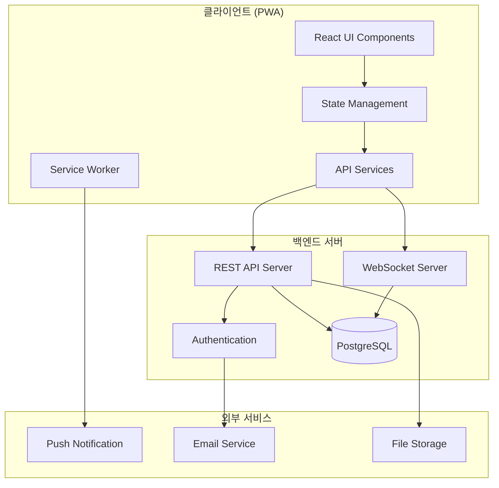
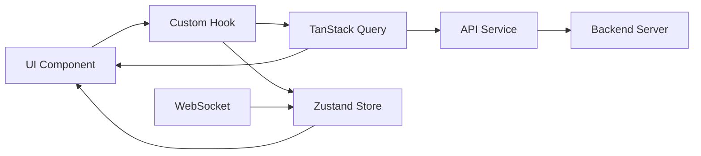
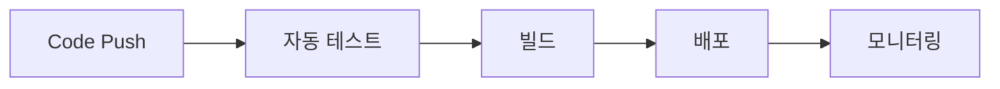

# 🏗️ 시스템 아키텍처

## 📋 개요

회의실 예약 시스템은 **모던 웹 기술 스택**을 기반으로 한 **확장 가능하고 유지보수가 용이한 아키텍처**를 채택합니다. 클라이언트-서버 분리 구조로 설계되어 있으며, 실시간 통신과 PWA 기능을 통해 우수한 사용자 경험을 제공합니다.

## 🎯 아키텍처 원칙

### 1. 관심사 분리 (Separation of Concerns)
- **프레젠테이션 계층**: React 컴포넌트 기반 UI
- **비즈니스 로직 계층**: 커스텀 훅과 서비스 계층
- **데이터 접근 계층**: API 서비스와 상태 관리

### 2. 단방향 데이터 흐름 (Unidirectional Data Flow)
- **상태 관리**: Zustand + TanStack Query
- **이벤트 기반**: WebSocket을 통한 실시간 업데이트
- **예측 가능한 상태 변화**: 명확한 액션과 리듀서 패턴

### 3. 컴포넌트 기반 설계 (Component-Based Architecture)
- **재사용 가능한 UI 컴포넌트**: shadcn/ui 기반
- **합성 패턴**: 작은 컴포넌트들의 조합
- **단일 책임 원칙**: 각 컴포넌트는 하나의 명확한 역할

## 🏛️ 전체 시스템 구조



## 🎨 프론트엔드 아키텍처

### 폴더 구조
```
src/
├── components/           # UI 컴포넌트
│   ├── features/        # 기능별 컴포넌트
│   ├── layout/          # 레이아웃 컴포넌트
│   └── ui/              # 재사용 가능한 UI 컴포넌트
├── hooks/               # 커스텀 훅
├── lib/                 # 유틸리티 함수
├── models/              # 데이터 모델 및 타입
├── pages/               # 페이지 컴포넌트
├── services/            # API 서비스
├── stores/              # 상태 관리
└── constants/           # 상수 정의
```

### 계층별 역할

#### 1. 프레젠테이션 계층 (Presentation Layer)
**위치**: `src/components/`, `src/pages/`

- **역할**: 사용자 인터페이스 렌더링 및 사용자 상호작용 처리
- **기술**: React 18, TypeScript, Tailwind CSS
- **특징**:
  - 상태를 직접 관리하지 않고 props로 받아 사용
  - 비즈니스 로직을 포함하지 않음
  - 재사용 가능하고 테스트하기 쉬운 구조

```typescript
// 예시: 프레젠테이션 컴포넌트
interface ReservationCardProps {
  reservation: Reservation
  onEdit: (id: string) => void
  onDelete: (id: string) => void
}

export function ReservationCard({ reservation, onEdit, onDelete }: ReservationCardProps) {
  return (
    <Card>
      <CardContent>
        <h3>{reservation.title}</h3>
        <p>{formatTime(reservation.startTime)} - {formatTime(reservation.endTime)}</p>
        <div>
          <Button onClick={() => onEdit(reservation.id)}>수정</Button>
          <Button onClick={() => onDelete(reservation.id)}>삭제</Button>
        </div>
      </CardContent>
    </Card>
  )
}
```

#### 2. 비즈니스 로직 계층 (Business Logic Layer)
**위치**: `src/hooks/`, `src/lib/utils/`

- **역할**: 애플리케이션의 핵심 비즈니스 규칙과 로직 처리
- **기술**: 커스텀 훅, 유틸리티 함수
- **특징**:
  - UI와 독립적인 비즈니스 로직
  - 재사용 가능한 로직 캡슐화
  - 테스트하기 쉬운 순수 함수

```typescript
// 예시: 비즈니스 로직 훅
export function useReservationActions() {
  const queryClient = useQueryClient()
  
  const createReservation = useMutation({
    mutationFn: (data: CreateReservationRequest) => 
      reservationApiService.createReservation(data),
    onSuccess: () => {
      queryClient.invalidateQueries(['reservations'])
      toast.success('예약이 생성되었습니다')
    },
    onError: (error) => {
      toast.error('예약 생성에 실패했습니다')
    }
  })
  
  return { createReservation }
}
```

#### 3. 데이터 접근 계층 (Data Access Layer)
**위치**: `src/services/`, `src/stores/`

- **역할**: 외부 데이터 소스와의 통신 및 상태 관리
- **기술**: TanStack Query, Zustand, Axios
- **특징**:
  - API 통신 로직 캡슐화
  - 캐싱 및 동기화 처리
  - 에러 처리 및 재시도 로직

```typescript
// 예시: API 서비스
class ReservationApiService {
  async createReservation(data: CreateReservationRequest): Promise<ApiResponse<Reservation>> {
    try {
      const validatedRequest = validateCreateReservationRequest(data)
      const response = await apiClient.post('/api/reservations', validatedRequest)
      return validateApiResponse(response.data, ReservationSchema)
    } catch (error) {
      throw new ApiError('예약 생성 실패', error)
    }
  }
}
```

## 🔄 상태 관리 아키텍처

### 상태 분류 및 관리 전략

| 상태 유형 | 관리 도구 | 사용 사례 | 예시 |
|-----------|-----------|-----------|------|
| **서버 상태** | TanStack Query | API 데이터, 캐싱 | 예약 목록, 회의실 정보 |
| **전역 클라이언트 상태** | Zustand | 인증, 설정 | 로그인 상태, 테마 설정 |
| **로컬 컴포넌트 상태** | useState/useReducer | UI 상태 | 모달 열림/닫힘, 폼 입력 |
| **URL 상태** | React Router | 라우팅 | 현재 페이지, 쿼리 파라미터 |

### 상태 흐름도



## 🔌 API 통신 아키텍처

### RESTful API 설계
- **Base URL**: `/api/v1`
- **인증**: JWT Bearer Token
- **응답 형식**: 일관된 JSON 구조
- **에러 처리**: 표준화된 에러 코드 체계

### WebSocket 실시간 통신
- **연결 관리**: 자동 재연결 로직
- **메시지 타입**: 타입 안전한 메시지 구조
- **상태 동기화**: TanStack Query 캐시와 연동

```typescript
// 실시간 메시지 타입 정의
interface WebSocketMessage {
  type: 'reservation_created' | 'reservation_updated' | 'reservation_deleted'
  data: {
    id: string
    reservation?: Reservation
    timestamp: string
  }
}
```

## 📱 PWA 아키텍처

### Service Worker 전략
- **캐싱 전략**: Stale-While-Revalidate
- **오프라인 지원**: 핵심 기능 오프라인 동작
- **백그라운드 동기화**: 네트워크 복구 시 자동 동기화

### App Shell 패턴
- **핵심 UI 구조**: 즉시 로딩 가능한 기본 레이아웃
- **동적 콘텐츠**: 필요에 따라 로드되는 데이터
- **점진적 향상**: 기본 기능 → 고급 기능 순차 로드

## 🔒 보안 아키텍처

### 인증 및 권한 관리
- **JWT 토큰**: 상태 없는 인증
- **권한 기반 접근 제어**: 역할별 기능 제한
- **토큰 갱신**: 자동 토큰 리프레시

### 데이터 보안
- **입력 검증**: Zod 스키마 기반 런타임 검증
- **XSS 방지**: React의 기본 보안 기능 활용
- **CSRF 방지**: SameSite 쿠키 정책

## 🚀 성능 최적화 아키텍처

### 번들 최적화
- **코드 분할**: 라우트 기반 동적 import
- **트리 셰이킹**: 사용하지 않는 코드 제거
- **번들 분석**: 정기적인 번들 크기 모니터링

### 렌더링 최적화
- **메모이제이션**: React.memo, useMemo, useCallback
- **가상화**: 큰 리스트의 가상 스크롤링
- **지연 로딩**: 이미지 및 컴포넌트 lazy loading

### 네트워크 최적화
- **캐싱 전략**: 브라우저 캐시 + Service Worker 캐시
- **압축**: Gzip/Brotli 압축
- **CDN**: 정적 자산 CDN 배포

## 🔄 CI/CD 아키텍처

### 자동화 파이프라인


### 배포 전략
- **Vercel**: 프론트엔드 자동 배포
- **Preview 배포**: PR별 미리보기 환경
- **Production 배포**: main 브랜치 자동 배포

## 📊 모니터링 아키텍처

### 성능 모니터링
- **Core Web Vitals**: LCP, FID, CLS 추적
- **사용자 경험**: 실제 사용자 데이터 수집
- **에러 추적**: 런타임 에러 자동 수집

### 비즈니스 메트릭
- **사용자 행동**: 예약 완료율, 기능 사용률
- **시스템 상태**: API 응답 시간, 에러율
- **PWA 메트릭**: 설치율, 재방문율
